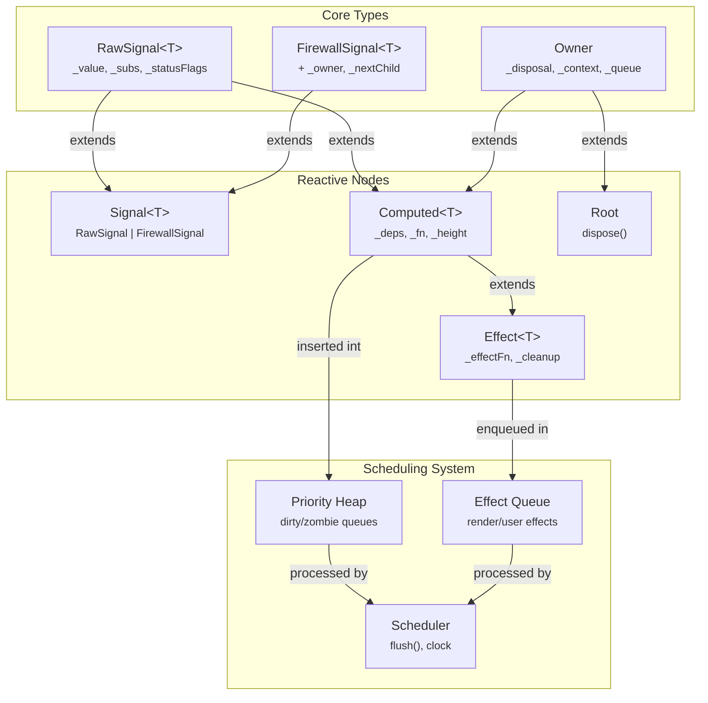

<h1 align="center"><code>sig</code></h1>

## TODOs

<details>
<summary>☑️ signals</summary>

```go
count, setCount := sig.Signal(0)
fmt.Println(count())

setCount(10)
fmt.Println(count())

// Output
// 0
// 10
```

</details>

<details>
<summary>☑️ computed</summary>

```go
count, setCound := sig.Signal(1)
double := sig.Computed(func() int {
    fmt.Println("doubling")
    return count()*2
})
fmt.Println(count())
fmt.Println(double())

setCount(10)
fmt.Println(count())
fmt.Println(double())

// Output:
// doubling
// 1
// 2
// doubling
// 10
// 20
```

</details>

<details>
<summary>🔄 effects</summary>

```go
count, setCound := sig.Signal(1)
fmt.Println(count())

sig.Effect(func() func() {
    fmt.Println(count()*2)
    return nil
})

setCount(10)
fmt.Println(count())

// Output:
// 1
// 2
// 20 -- note that effects run immediately on setCount(). this is different than Solid's reactive system (see Batch() for alternatives)
// 10
```

</details>

<details>
<summary>☑️ batch</summary>

```go
count, setCound := Signal(1)
fmt.Println(count())

Effect(func() func() {
    fmt.Println(count()*2)
    return nil
})

Batch(func () {
    setCount(10)
    fmt.Println(count())
})

// Output:
// 1
// 2
// 10
// 20 -- now with batch, effects are defered to the end of the batch, so 10 is logged before 20.
//       batch can also be used to update a state multiple times while making sure its effects are only run once.
```

</details>

<details>
<summary>⬜ owner</summary>

```go
// mainly used by framework authors to "own" a reactive context and dispose it when appropriate
owner := sig.Owner()
owner.OnError(func (err error) {
    fmt.Println("recovered:", err)
})

owner.Run(func() {
    count, setCound := sig.Signal(1)
    fmt.Println(count())

    sig.Effect(func() func() {
        fmt.Println(count()*2)
        return func() {
            fmt.Println("disposed")
        }
    })

    setCount(10)
    fmt.Println(count())
})

owner.Dispose()

// Output:
// doubling
// 1
// 2
// disposed
// 20
// 10
// disposed
```

</details>

<details>
<summary>⬜ async computed</summary>

```go
userID, setUserID := sig.Signal(0)
user := sig.AsyncComputed(func() (User, error) { // func is called in a goroutine
    return getUser(userID())
})

sig.Effect(func() func() {
    if sig.IsPending(user) { // uses the panic logic to know if the computed node has resolved yet or not
        fmt.Println("loading...")
        return nil
    }

    // if we're in a reactive scope and user has not resolved yet, this will panic and be recovered to tell the node one of its dependencies is not ready.
    // else it returns an error to avoid panics in a scope not owned by the reactive system.
    u, err := user()
    if err {
        fmt.Println("error:", err)
        return nil
    }

    fmt.Println("user:", u.Name)
    return nil
})

// Output:
// loading...
// user: Bob
```

</details>

<details>
<summary>⬜ context</summary>

```go
ctx := sig.Context("light") // default value

owner := sig.Owner()
owner.Run(func() {
    sig.SetContext[string](ctx, "dark")

    sig.Owner().Run(func() {
        theme := sig.GetContext[string](ctx)
        fmt.Println(theme)
    })
})

theme := sig.GetContext[string](ctx) // returns default value
fmt.Println(theme)

// Output:
// dark
// light
```

</details>

<details>
<summary>⬜ untrack</summary>

```go
count, setCount := sig.Signal(1)
other, setOther := sig.Signal(10)

sig.Effect(func() func() {
    fmt.Println(count(), sig.Untrack(other))
    return nil
})

setCount(2)
setOther(20)

// Output:
// 1, 10
// 2, 10 -- stops here and no effect is triggered for the setOther(20)
```

</details>

### Solid's Architecture



---

<details>
<summary>
The storying behind <code>sig</code>
</summary>

i have things to tell.

</details>
